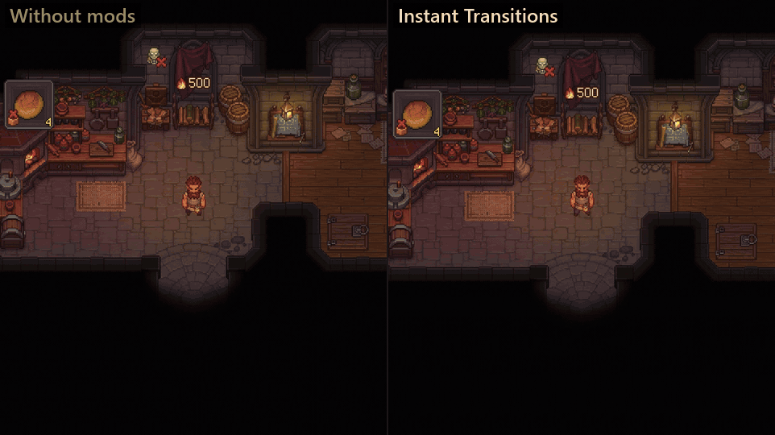

# Instant Transitions para Graveyard Keeper 2

[English](README.md) | **Español**

Cada puerta de Graveyard Keeper 2 congela el juego con la pantalla en negro entre 1 y 2 segundos, y más mientras más mods tengas. **Instant Transitions** deja las puertas y los viajes por el mapa en unos **0.3 segundos**, incluso la primera vez que entras a un lugar.

> ⚠️ **Beta (0.9.0).** Las puertas y la carga están medidas y probadas. Las sesiones largas todavía se están probando: si algo se siente raro, [repórtalo](#reportar-errores) con tu registro. Ayuda muchísimo.

---

## Qué hace

| | Sin mods | Con Instant Transitions |
|---|---|---|
| Una puerta (casa ↔ patio) | 1.4–1.9 s (hasta 2.6 s con muchos mods) | **~0.3 s** |
| Viajar por el mapa | ~1.8 s | **~0.3 s** |
| Primera visita a un lugar | +0.3–1.3 s mientras carga | **igual que cualquier otra visita** |
| Cargar una partida | lo normal | unos 5 s más, con una línea de avance |

**El congelón en cada puerta.** Con la pantalla en negro, el juego hace una limpieza completa de memoria en cada puerta: libera recursos sin usar, recoge basura y busca 24 veces, por todo lo cargado, componentes que solo sirven en el editor. Eso es casi toda la espera. La recolección de basura del juego ya trabaja en pedacitos mientras juegas, así que este mod se salta la limpieza completa en las puertas y la hace solo cada 10 minutos (o antes si la memoria crece 300 MB), y siempre al cargar partida. Cada puerta queda medida en el registro, para comprobar que nada se acumula.

**Fundidos más cortos.** En las puertas que usas y en los viajes por el mapa, los fundidos duran 0.15 s en vez de 0.3 s, y desaparece la pausa extra de 0.3 s en negro. Las peleas y las escenas de historia conservan los tiempos del juego.

**Primeras visitas rápidas.** Mientras carga una partida, el juego precarga una lista fija de las piezas con las que se dibujan los lugares. Lo que no está en esa lista (por ejemplo, lo que construiste en tu patio) se carga del disco la primera vez que lo ves, en un cuadro congelado. Instant Transitions precarga el resto del mapa al final de la pantalla de carga, varias piezas a la vez, para que la primera visita sea tan rápida como las siguientes. Una línea bajo la barra de carga muestra el avance. Usa unos 500 MB más de memoria y se omite en PCs con menos de 7 GB de RAM.

**Compáralo tú mismo.** Presiona **Ctrl + Shift + O** mientras juegas para prender o apagar el mod. El cambio aplica desde la siguiente puerta y un aviso muestra cómo quedó.

---

## Instalación (unos 2 minutos)

Solo se hace una vez. Cierra el juego antes de empezar.

### Paso 1: Descarga el mod

Entra a [Releases](../../releases) y descarga **uno** de estos archivos:

- **`InstantTransitions-x.y.z-with-BepInEx.zip`**: elige este si no estás seguro. Trae todo lo necesario.
- `InstantTransitions-x.y.z.zip`: solo el mod. Úsalo si ya juegas con otros mods de BepInEx.

### Paso 2: Copia la dirección de la carpeta del juego

1. Abre **Steam** y ve a tu **Biblioteca**.
2. Clic derecho en **Graveyard Keeper 2** → **Administrar** → **Ver archivos locales**. Se abre una carpeta: es la *carpeta del juego*.
3. Haz clic en la **barra de dirección** de arriba y presiona **Ctrl + C** para copiarla.

### Paso 3: Extrae el mod en esa carpeta

1. Busca el archivo que descargaste (normalmente en **Descargas**).
2. Clic derecho → **Extraer todo…**
3. Borra la ruta del cuadro y presiona **Ctrl + V** para pegar la dirección de la carpeta del juego.
4. Clic en **Extraer**. Si Windows pregunta por reemplazar archivos, elige **Reemplazar**.

### Paso 4: Comprueba que funcionó

Abre el juego y carga tu partida. Cerca del final de la pantalla de carga verás *"Preparando los lugares para que las puertas sean rápidas…"* bajo la barra. Luego cruza cualquier puerta. 🎉

<b>Actualizar o desinstalar</b>

- **Actualizar:** extrae la versión nueva igual, eligiendo **Reemplazar**.
- **Desinstalar:** borra la carpeta `BepInEx\plugins\InstantTransitions` dentro de la carpeta del juego. Tus partidas nunca se tocan.

---

## Ajustes

Los ajustes están en `BepInEx\config\verto13.gk2.instanttransitions.cfg` (se crea la primera vez que juegas; ábrelo con el Bloc de notas con el juego cerrado). Cada ajuste viene explicado adentro:

| Ajuste | De fábrica | Qué hace |
|---|---|---|
| `Enabled` | `true` | `false` = todo como el juego sin mods; el mod solo mide las puertas. |
| `ToggleKey` | `Ctrl + Shift + O` | Prende y apaga el mod mientras juegas. |
| `FullCleanupEveryMinutes` | `10` | Cada cuánto una puerta todavía hace la limpieza completa del juego. |
| `FullCleanupWhenMemoryGrowsMB` | `300` | O antes, si la memoria creció esto. |
| `FadeSeconds` | `0.15` | Duración de cada fundido en puertas y viajes (el juego: 0.3). |
| `BlackPauseSeconds` | `0` | Pausa en negro antes de moverte (el juego: 0.3). |
| `PreloadPlaces` | `true` | Precargar todo el mapa al cargar partida. |
| `PreloadMaxSeconds` | `20` | La precarga nunca alarga la carga más que esto. |

## Qué cambia / compatibilidad

- No toca tus partidas ni cambia el balance. Puedes apagarlo (o quitarlo) cuando quieras.
- Usa **un solo** mod que cambie las puertas o la limpieza de memoria del juego; dos se pelearían por lo mismo.
- Probado con Graveyard Keeper 2 1.006 y BepInEx 5.4.23.5, junto con una docena de mods más.

## Reportar errores

Abre un [issue](../../issues/new) e incluye:

1. Qué hiciste y qué pasó.
2. El archivo `BepInEx\LogOutput.log` de la carpeta del juego. Ahí queda cada puerta, pantalla de carga y limpieza (líneas `[Door]`, `[Load]`, `[Preload]` y `[Clean-up]`), y con eso los problemas se encuentran rápido.

## Licencia

[MIT](LICENSE). Hecho por VERTO13, con ayuda de IA.
