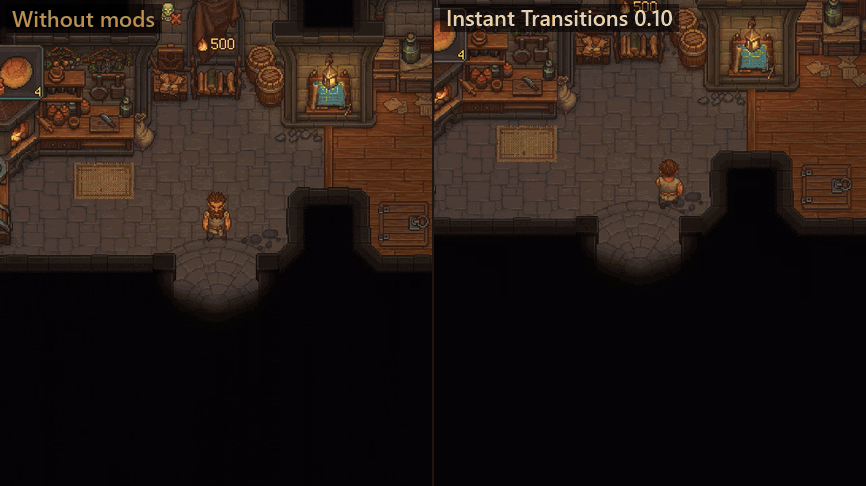
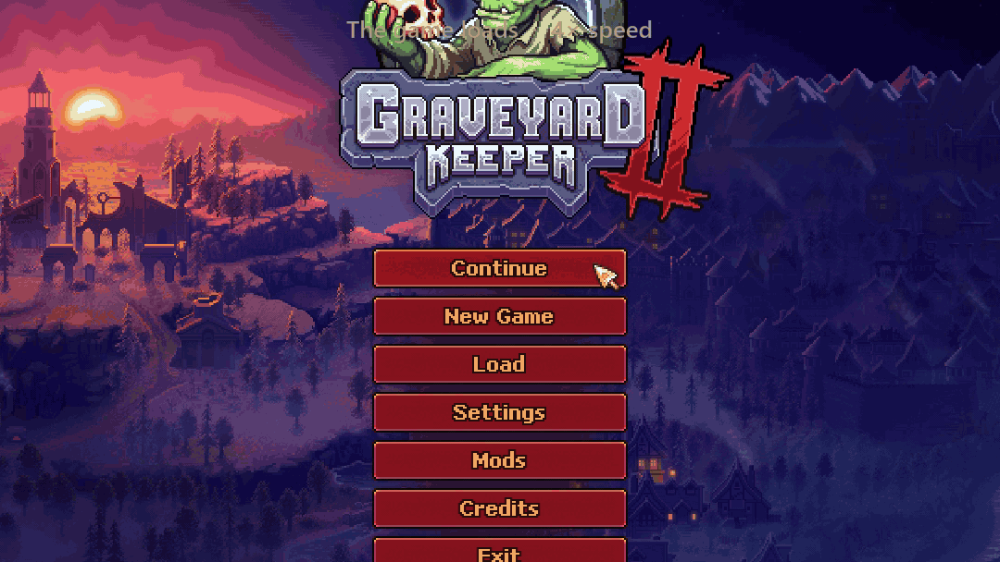

# Instant Transitions for Graveyard Keeper 2

**English** | [Español](README.es.md)

Every door in Graveyard Keeper 2 takes you through a black screen: about a second since game version 1.008, and 1 to 2 seconds before it. With **Instant Transitions** the whole map feels like one place: you **walk into** a door and, in the same instant, you're on the other side, still walking. No black screen, no freeze, no "[E] Enter".

> ⚠️ **Beta (0.10.1).** Doors, map travel and loading are measured and tested, and every door on the map was checked. If anything feels off, please [report it](#reporting-bugs) with your log. It really helps.

---

## What it does

| | Without the mod | With Instant Transitions |
|---|---|---|
| A door (home ↔ yard) | about 0.9 s through black (1.4–1.9 s before game version 1.008) | **~0.1 s, no black** |
| Map travel | 0.9–1.4 s through black (~1.8 s before game version 1.008) | **0.1–0.3 s, no black** |
| First visit to a place | +0.3–1.3 s while it loads | **the same as any other visit** |
| Loading a save | as usual | about 5 s longer, with a progress line |

**A cut instead of a fade.** Doors and map travel inside the same scene (and the whole map is one scene: home, yard, tavern, church, morgue…) don't go through black anymore. You're moved in the same frame, like a cut in a film: the old view stays on screen for about three frames while the new place is drawn, then it's gone. Doors that lead to another scene still use a quick black.

**Walk in.** No need to press E: walk into a door and you go through just as you reach it, without bumping into it. Where the floor ends before the door (the tavern's porch, the top of the barracks stairs) your character keeps walking up to the door, or down a few steps, before the cut. Only your character's drawing moves; your position and your save don't change.

**No prompt, no bouncing back.** The "[E] Enter" over those doors is hidden, so they feel like part of the map (**Ctrl + Shift + H** brings it back). Floor hatches keep the key, and so do ladders you climb. The door you just came through waits until you let go of the movement key, turn around or walk away, so you never bounce back by accident. During fights, doors only work with the key.

**Ready before you arrive.** The first time in a while that you go through a door, the game loads the pieces of the other side before it lets you move, and the cut would wait for it. When you get near a door, Instant Transitions loads its other side ahead of time, out of view and a little each frame, so the cut never waits.

**No freeze at doors.** Before version 1.008, the game ran a full memory clean-up on every door, with the screen black: it unloaded unused assets, collected garbage and searched everything loaded, 24 times over, for editor-only components. That was most of the wait. Since 1.008 the game only does it when a door leads to another scene. This mod never does it all at once at a door: every third door removes one of the 24 kinds of editor-only components (about 30 ms), so nothing piles up, and unused assets are unloaded at a door only now and then: when memory has grown a lot, or every 10 minutes at a door that leads to another scene. Loading a save always does the full clean-up.

**Fast first visits.** While a save loads, the game preloads a fixed list of the pieces places are drawn with. Anything not on that list (for example, what you built in your yard) loads from disk the first time you see it, in one frozen frame. Instant Transitions preloads the rest of the map near the end of the loading screen, several at a time. A line under the loading bar shows the progress. This uses about 500 MB more memory and is skipped on PCs with less than 7 GB of RAM.

**Keys.** None of them clash with the game's own keys, and you can change them in the settings:

| Key | What it does |
|---|---|
| **Ctrl + Shift + O** | Turns the whole mod on and off, to compare with the unmodded game. |
| **Ctrl + Shift + C** | Turns walking into doors on and off. Off, every door works with E and shows its prompt. |
| **Ctrl + Shift + H** | Shows or hides the "[E] Enter" prompts over doors. |

---

## Installation (about 2 minutes)

You only do this once. Close the game before you start.

### Step 1: Download two files

1. **BepInEx 5**, the mod loader (skip it if you already play with other BepInEx mods): from its [official page](https://github.com/BepInEx/BepInEx/releases/tag/v5.4.23.5), download **`BepInEx_win_x64_5.4.23.5.zip`**.
2. **Instant Transitions**: from [Releases](../../releases) or the [Nexus Mods page](https://www.nexusmods.com/graveyardkeeper2/mods/206), download **`InstantTransitions-x.y.z.zip`**.

### Step 2: Copy the address of your game folder

1. Open **Steam** and go to your **Library**.
2. Right-click **Graveyard Keeper 2** → **Manage** → **Browse local files**. A folder opens; this is your *game folder*.
3. Click the **address bar** at the top of that folder, then press **Ctrl + C** to copy it.

### Step 3: Extract both files into that folder

Do this first with BepInEx, then with Instant Transitions:

1. Find the file you downloaded (usually in **Downloads**).
2. Right-click it → **Extract All…**
3. Delete the path in the box, then press **Ctrl + V** to paste your game folder's address.
4. Click **Extract**. If Windows asks about replacing files, choose **Replace**.

### Step 4: Check that it worked

Start the game and load your save. Near the end of the loading screen you'll see *"Preparing places so doors are quick…"* under the bar. Then walk into any door. 🎉

<b>Update or uninstall</b>

- **Update:** extract the new version the same way, choosing **Replace**.
- **Uninstall:** delete the folder `BepInEx\plugins\InstantTransitions` inside your game folder. Your saves are never touched.

---

## Settings

Settings live in `BepInEx\config\verto13.gk2.instanttransitions.cfg` (created the first time you play; open it with Notepad while the game is closed). Every setting is explained inside:

| Setting | Default | What it does |
|---|---|---|
| `Enabled` | `true` | `false` = everything as in the unmodded game; the mod only measures doors. |
| `ToggleKey` | `Ctrl + Shift + O` | Turns the mod on and off while playing. |
| `HardCut` | `true` | Doors and map travel in the same scene cut with no black. `false` = a quick fade through black. |
| `WalkIntoDoors` | `true` | Walk into doors to go through them. `false` = doors only with the key, as in the game. |
| `WalkInKey` | `Ctrl + Shift + C` | Turns walking into doors on and off while playing. |
| `HideDoorPrompts` | `true` | Hides the "[E] Enter" prompt over doors you can walk into. |
| `PromptsKey` | `Ctrl + Shift + H` | Shows or hides those prompts while playing. |
| `FullCleanupEveryMinutes` | `10` | How often a door through black unloads unused assets (about 0.3 s). Doors never run the game's full clean-up. |
| `FullCleanupWhenMemoryGrowsMB` | `300` | Or sooner, once memory has grown this much. Doors with the cut only do it at twice this. |
| `FadeSeconds` | `0` | Length of each fade on the doors that still go through black. `0` = no fade (the game: 0.3). |
| `BlackPauseSeconds` | `0` | Pause in black before you're moved, on those doors (the game: 0.3). |
| `PreloadPlaces` | `true` | Preload the whole map while a save loads. |
| `PreloadMaxSeconds` | `20` | The preload never makes loading longer than this. |

## What it changes / compatibility

- It doesn't touch your saves or change any balance. Turn it off (or uninstall it) at any time.
- Use only **one** mod that changes doors or the game's memory clean-up; two of them would fight over the same thing.
- **Black screen after loading, or Jack missing at his boat?** Since 0.10.1 this mod no longer causes it, but another mod still can. It happens when you load a save made the night before a morning scene (like Jack's first visit) and a mod keeps the loading screen up a few seconds longer at the very end: the game starts that scene before the loading screen is gone and then removes its speech bubble, so the scene waits forever. This mod's preload used to do that; now it runs earlier.
- Tested with Graveyard Keeper 2 1.008 and BepInEx 5.4.23.5, alongside many other mods. It also loads on older versions of the game (1.004.2 and up): anything the game doesn't have yet turns itself off, with a line in the log.

What each version changed: [release notes](CHANGELOG.md).

## Reporting bugs

Open an [issue](../../issues/new) and include:

1. What you did and what happened (which door, if it's about a door).
2. The file `BepInEx\LogOutput.log` from your game folder. Every door, loading screen and clean-up is written there (`[Door]`, `[Walk-in]`, `[Load]`, `[Preload]`, `[Prewarm]` and `[Clean-up]` lines), which makes problems easy to find.

## License

[MIT](LICENSE). Made by VERTO13, with AI assistance.
